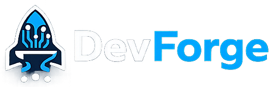

<p align="center">
  
</p>

<h3 align="center">DevForge Documentation Website</h3>

<p align="center">
  The official documentation and marketing site for <strong>DevForge</strong> — an agentic AI-powered CLI that generates production-ready CI/CD pipelines, scans for compliance issues, and automates infrastructure deployment.
</p>

<p align="center">
  <a href="https://devforge-ai.vercel.app">Live Site</a> ·
  <a href="https://devforge-ai.vercel.app/docs">Documentation</a> ·
  <a href="https://github.com/apurvv28/DevForge">CLI Repository</a> ·
  <a href="https://www.npmjs.com/package/@apurvv28/devforge">npm Package</a>
</p>

---

## Overview

This repository contains the **DevForge documentation website** — a modern, glassmorphic Next.js application that serves as both the marketing landing page and the full documentation hub for the DevForge CLI tool.

### Key Pages

| Route | Description |
|:------|:------------|
| `/` | Marketing landing page with hero, features, stats, and CTAs |
| `/docs` | Documentation overview with quick-start and section links |
| `/docs/getting-started/*` | Installation, quick start, and offline mode guides |
| `/docs/commands` | Complete CLI command reference |
| `/docs/agentic-workflow` | Agent system, LLM providers, LangGraph, cache, and memory |
| `/docs/security/*` | Security model, compliance agent, and auto-fix capabilities |
| `/docs/iac/*` | IaC detection, generation, verification, and deployment targets |
| `/docs/cli-reference` | Full command reference |
| `/docs/changelog` | Release changelog |
| `/docs/contributing` | Contributor guide |
| `/docs/security-policy` | Vulnerability reporting policy |

---

## Tech Stack

| Layer | Technology |
|:------|:-----------|
| **Framework** | [Next.js 16](https://nextjs.org) (App Router) |
| **Language** | TypeScript 5 |
| **Styling** | [Tailwind CSS 4](https://tailwindcss.com) + CSS custom properties (design tokens) |
| **Animations** | [Framer Motion](https://www.framer.com/motion/) |
| **Content** | MDX via `@next/mdx` with `rehype-pretty-code`, `rehype-slug`, `remark-gfm` |
| **Search** | [Fuse.js](https://www.fusejs.io/) — client-side fuzzy search |
| **Icons** | [Lucide React](https://lucide.dev) |
| **AI Assistant** | NVIDIA GLM 5.1 via OpenAI-compatible SDK (streaming SSE) |
| **Fonts** | Geist Sans & Geist Mono |

---

## Features

- ✨ **Glassmorphic UI** — Frosted glass panels, subtle glows, and dynamic gradients across light and dark themes
- 🌗 **Light / Dark Mode** — Full theme system with CSS custom properties and smooth transitions
- 🔍 **Inline Search** — Fuzzy search across all documentation pages with autocomplete dropdown
- 🤖 **AI Assistant** — Streaming chat panel powered by NVIDIA GLM 5.1, context-aware with DevForge documentation knowledge
- 📱 **Fully Responsive** — Mobile-first layout with slide-in sidebar, adaptive AI panel, and responsive grids
- 📖 **MDX Content** — Markdown documentation with syntax-highlighted code blocks (Shiki), GFM tables, and auto-generated heading slugs
- 🧭 **Sidebar Navigation** — Collapsible accordion sidebar with active route highlighting and localStorage persistence
- 📑 **Table of Contents** — Auto-generated from page headings with scroll-spy active state
- ⚡ **Framer Motion** — Smooth page transitions, hover effects, and micro-animations throughout

---

## Getting Started

### Prerequisites

- **Node.js** ≥ 18
- **npm** ≥ 9

### Installation

```bash
# Clone the repository
git clone https://github.com/apurvv28/devforge-web.git
cd devforge-web/frontend

# Install dependencies
npm install
```

### Environment Variables

Create a `.env` file in the `frontend/` directory:

```env
# Required for the AI Assistant (NVIDIA GLM via OpenAI-compatible API)
NVIDIA_GLM_OPENAI_API_KEY=your_nvidia_api_key_here
```

> **Note:** The AI Assistant is optional. The documentation site works fully without it — the chat endpoint will return an error, but nothing else is affected.

### Development

```bash
npm run dev
```

Open [http://localhost:3000](http://localhost:3000) in your browser. The app supports hot reload.

### Production Build

```bash
npm run build
npm start
```

### Type Checking

```bash
npm run type-check
```

### Linting

```bash
npm run lint
```

---

## Project Structure

```
frontend/
├── app/
│   ├── api/
│   │   └── chat/
│   │       └── route.ts          # AI Assistant API (NVIDIA GLM proxy)
│   ├── docs/
│   │   ├── layout.tsx            # Docs layout (sidebar + navbar + AI)
│   │   ├── page.tsx              # Docs overview page
│   │   ├── agentic-workflow/     # Agent system docs
│   │   ├── changelog/            # Changelog page
│   │   ├── cli-reference/        # CLI reference page
│   │   ├── commands/             # Commands documentation
│   │   ├── contributing/         # Contributing guide
│   │   ├── dependencies/         # Dependency review
│   │   ├── getting-started/      # Installation & quick start
│   │   ├── iac/                  # Infrastructure as Code docs
│   │   ├── security/             # Security & compliance docs
│   │   └── security-policy/      # Security policy page
│   ├── fonts.ts                  # Geist font configuration
│   ├── globals.css               # Global styles & design tokens
│   ├── layout.tsx                # Root layout
│   └── page.tsx                  # Landing page
├── components/
│   ├── AIAssistant.tsx           # AI chat panel + context provider
│   ├── ChangeLogFeed.tsx         # Changelog feed component
│   ├── ComparisonTable.tsx       # Feature comparison table
│   ├── FeatureGrid.tsx           # Feature grid component
│   ├── Navbar.tsx                # Top navigation bar
│   ├── SearchModal.tsx           # Search modal component
│   ├── Sidebar.tsx               # Collapsible sidebar + mobile overlay
│   ├── TableOfContents.tsx       # Auto-generated TOC with scroll-spy
│   ├── ThemeProvider.tsx         # Theme context provider
│   └── VersionBadge.tsx          # Version badge component
├── docs/                         # Raw markdown documentation files
│   ├── AGENT.md
│   ├── AGENT_GRAPH.md
│   ├── COMMANDS.md
│   ├── DEPENDENCIES.md
│   ├── IAC.md
│   ├── SECURITY.md
│   └── SECURITY_COMPLIANCE.md
├── public/                       # Static assets (logos, icons)
├── next.config.ts                # Next.js + MDX configuration
├── package.json
├── tsconfig.json
└── postcss.config.mjs
```

---

## Design System

The site uses a custom design token system via CSS custom properties, enabling seamless light/dark theme switching:

| Token | Light | Dark | Purpose |
|:------|:------|:-----|:--------|
| `--bg` | `#ffffff` | `#000000` | Base background |
| `--accent` | `#0284c7` | `#38bdf8` | Primary accent (sky blue) |
| `--accent-2` | `#0ea5e9` | `#0ea5e9` | Secondary accent |
| `--bg-glass` | `rgba(255,255,255,0.60)` | `rgba(0,0,0,0.65)` | Glassmorphic panels |
| `--border-strong` | `rgba(14,165,233,0.32)` | `rgba(56,189,248,0.28)` | Accent borders |
| `--accent-glow` | `rgba(14,165,233,0.18)` | `rgba(56,189,248,0.22)` | Glow effects |

The color palette follows an **80/10/10 rule**: 80% base (white or black), 10% contrast, 10% sky-blue accent.

---

## AI Assistant

The docs pages include an embedded AI assistant powered by **NVIDIA GLM 5.1** (via the OpenAI-compatible API). It is toggled from the bot icon (🤖) in the navbar.

### Architecture

```
User Input → Frontend (SSE fetch) → /api/chat (Next.js API Route)
                                        ↓
                                   OpenAI SDK → https://integrate.api.nvidia.com/v1
                                        ↓
                                   z-ai/glm-5.1 model
                                        ↓
                              Streaming SSE ← chunks back to client
```

### Features

- Streaming token-by-token responses
- Full conversation context maintained per session
- Markdown rendering (bold, inline code, code blocks, **tables**)
- Pre-loaded system prompt with DevForge documentation context
- Suggestion chips for common questions
- Mobile-responsive (full-screen on phones, sheet on tablets)

---

## Deployment

### Vercel (Recommended)

1. Push to GitHub
2. Import the repo into [Vercel](https://vercel.com)
3. Set the root directory to `frontend/`
4. Add `NVIDIA_GLM_OPENAI_API_KEY` to environment variables
5. Deploy

### Docker

```dockerfile
FROM node:18-alpine AS builder
WORKDIR /app
COPY package*.json ./
RUN npm ci
COPY . .
RUN npm run build

FROM node:18-alpine AS runner
WORKDIR /app
COPY --from=builder /app/.next ./.next
COPY --from=builder /app/public ./public
COPY --from=builder /app/package*.json ./
COPY --from=builder /app/node_modules ./node_modules
EXPOSE 3000
CMD ["npm", "start"]
```

---

## Scripts

| Script | Command | Description |
|:-------|:--------|:------------|
| **dev** | `npm run dev` | Start development server with Webpack |
| **build** | `npm run build` | Create production build |
| **start** | `npm start` | Start production server |
| **lint** | `npm run lint` | Run ESLint |
| **type-check** | `npm run type-check` | Run TypeScript compiler checks |

---

## Contributing

1. Fork the repository
2. Create a feature branch: `git checkout -b feature/my-feature`
3. Commit your changes: `git commit -m 'Add my feature'`
4. Push to the branch: `git push origin feature/my-feature`
5. Open a Pull Request

Please ensure `npm run type-check` and `npm run lint` pass before submitting.

---

## License

This project is licensed under the **MIT License**.

---

<p align="center">
  Built with ❤️ by <a href="https://github.com/apurvv28">Apurv</a>
</p>
